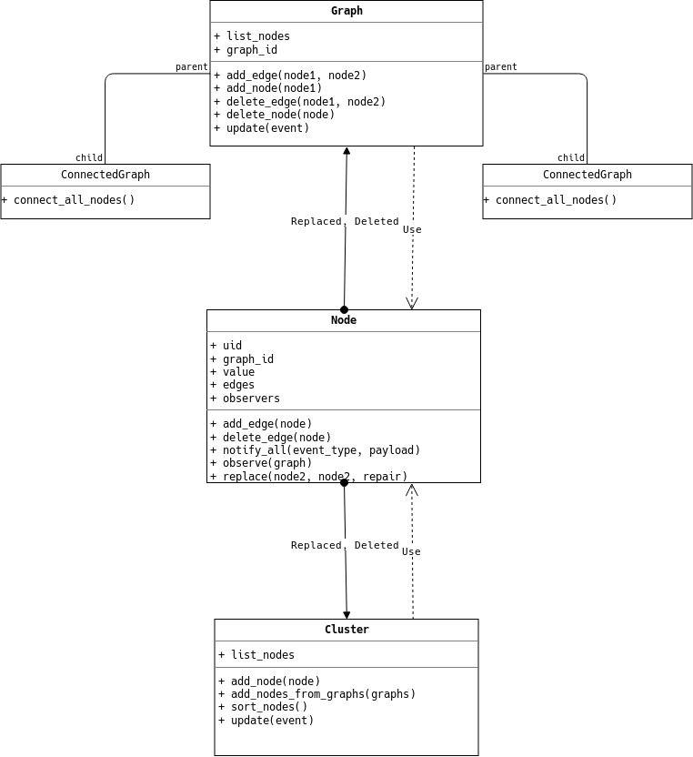

.. _design:

=======
Design 
=======

Overview
^^^^^^^^^

The source code is made up of three main components:

 1. Nodes
 2. Graphs and Clusters
 3. Repair Compression 

1. Nodes
--------

Nodes are the basic building blocks of everything. Different kinds of graphs are formed by connecting these nodes in different ways, repair compresses graphs and clusters by replacing nodes, and decompression works similarly. At the most basic level, a node is simply a value and a list. The list has a references to every other node this node points (for every edge beween this node and any other node). This makes it easier to represent graphs in the standard adjacency form by simply having a list of nodes. [1]_ 

In addition to the value and edges list, nodes also provide some other functionalities. These functionalities are placed in the node class, instead of in graphs, because they might enable parallelism when we need to optimize in the future (e.g. `replace`). In other cases, they simply make more sense inside nodes than  anywhere else (e.g. `add_edge`).

Each node has a unique id, `uid`, because every node must be uniquely identifiable. [2]_
Nodes also have a `graph_id` attribute. This is necessary because when we create clusters, we would like to have nodes from the same graph appear closer to each other.

2. Graphs and Clusters
----------------------

Graphs are composed of nodes, both in representation and behavior. We transfer most actions to the nodes, e.g. `add_edge`. The graphs' responsibility is to first ensure a given action is acceptable, e.g. when adding an edge at least the first node should be in the graph. Second, graphs act as message relays between nodes by acting as 'owners' of nodes. Agraph owns a node if the graph's ID matches the `graph_id` of the node. This graph is responsible for a few things. If it deletes the node, it must send a notification to other graphs to remove all edges coming to the node. If it recieves an event that the node should be replaced by something else, it must remove the node from its adjacency list and add the replacement in its position. Only the owner graph can delete a node. 

There are different graphs that are created by inheriting from the main `Graph` class. These graphs enforce specific properties in addition to the parent's requirements. For example, `CompleteGraph` ensures that every node is always connected to all other nodes. This is useful when we create clusters. 

A cluster is a group of graphs that have edges connecting nodes across graph boundaries.This lets us artificially simulate data with various properties. For example, a social network can be simulate by using a cluster of hub and spoke graphs (under the assumption that there are some people who have a lot of edges (hubs) and most people have few edges). Clusters are represented exactly like graphs but they *are* not graphs. They don't provide most of the functionalities graphs provide and they don't have ids. A cluster is basically formed by creating a group of graphs that are interconnected, and then extracting all the nodes from these graphs into the cluster. The function `weakly_connected_graphs` provides a way to create clusters out of graphs. The function is paramterized so that you can control edge density between graphs, within graphs, and number of graphs. 

3. Repair Compression
---------------------

Repair is a simple compression algorithm. It trades more nodes in the graph for fewer edges, hence compressing the graph. Another way to think of this is, it converts a dense but small graph into a sparse but larger graph (size measured in nodes). The basic idea is to look through the graph, or the cluster, and find the most common pair of nodes that show up adjacent to one another. Consider the following example::

       N1: B, C, D
       N2: B, C, A, E
       N3: B, C, D
 
The nodes `B` and `C` show up next to each other three times, so they are the most common pair. Then replace the most common pair with a single node which points to the replaced nodes. In the example above, we could replace the pair `BC` by `N4` like so::

       N1: N4, D
       N2: N4, A, E
       N3: N4, D
       N4: B, C

We have increased the total node count by 1 but we have decreased the total number of edges by 1. For some graphs, the decrease in edges can quickly outpace the increase in nodes. See the dissertation in :ref:`ref` for more on this.   

Architecture
^^^^^^^^^^^^

The architecture can be divided into two main components: Cluster/Graphs/Nodes and Repair. Repair is the implementation of the compression algorithm that depends on the other three, but it's design and implementation is fairly independent of them. 

Clusters, Graphs, and Nodes
---------------------------

A good portion of the codebase is dedicate to the implementation of an extendable Graph system. This implementation would be trivial if we didn't intend on creating clusters, i.e. edges are formed between two nodes within the same graph only. But if edges could be formed between two different graphs, the problem becomes a little more involved. For example, what if one of the graphs deletes one of the nodes of this edge? Because of the way Python handles references, the node wouldn't really be deleted. Python deletes objects when there are no references to the object and in this case the edge will keep a reference to to the node.

While it is still  possible to solve this in a bruteforce way (e.g. check every single node for references), such a solution would make it impossible to extend the implementation in the future and harder to test, not to mention the performance degradation. 

.. [1] Older versions of the code actually had a list of list implementation. This quickly got out of control and we ended up refactoring the codebase. 

.. [2] Previous implementations made use of the value to identify nodes. This turned out to be an unnecessary limitation (e.g. the data can't have two 5s). 

